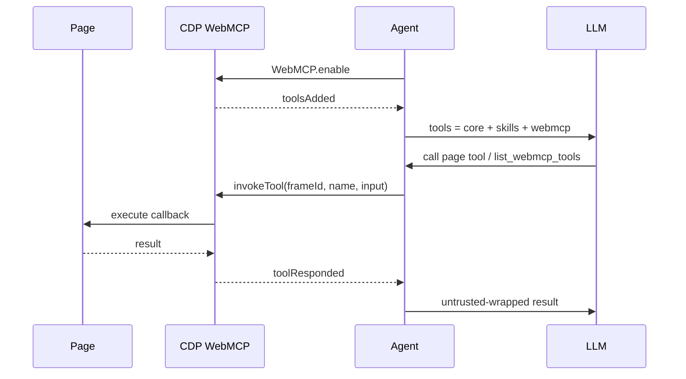

# WebMCP Integration

WebBrain can discover and invoke [WebMCP](https://github.com/webmachinelearning/webmcp) tools that a page registers for AI agents. Instead of reverse-engineering the UI through the accessibility tree, the agent can call structured page tools with JSON Schema inputs.

Issue: [#305](https://github.com/webbrain-one/webbrain/issues/305).

---

## What ships

| Surface | Behavior |
|---|---|
| Discovery | Chrome CDP `WebMCP.enable` + `toolsAdded` / `toolsRemoved`. Fallback: `Runtime.evaluate` → `document.modelContext.getTools()` (legacy `navigator.modelContext` also tried). |
| Invocation | CDP `WebMCP.invokeTool` → wait for `toolResponded`. Fallback: `document.modelContext.executeTool(tool, argsJson)`. |
| Model context | Discovered tools are merged into the LLM tool list each agent-loop iteration (same pattern as skill tools). |
| Meta tool | `list_webmcp_tools` — Ask/Act/Dev, all tiers — inspect schemas without guessing. |
| Mode rules | Read-only annotated tools work in Ask. Mutating tools require Act or Dev. |
| Permissions | Mutating WebMCP tools use capability `webmcp` (`Capability.WEBMCP`) gated per host. |
| Trust | Tool results are untrusted page data (`resultPolicy: untrusted` by default) and wrapped like other page reads. |
| Settings | Settings → Advanced → **WebMCP page tools** (`useWebMcp`, default on in Chrome). |
| Firefox | Schema + stub only. `list_webmcp_tools` returns a clear Chrome-only error. |

---

## Agent loop

Prefer WebMCP when a declared tool matches the user goal; fall back to `get_accessibility_tree` + `click_ax` / `type_ax` / `set_field` when none fits.

---

## Chrome requirements

WebMCP is still an origin trial / experimental platform API:

1. Chrome 149+ origin trial for production sites, or
2. Local testing: `chrome://flags/#enable-webmcp-testing` → Enabled → relaunch.

Without WebMCP on the page (or without the platform API), discovery returns empty and the agent continues with the normal DOM/AX path.

---

## Security model

WebMCP does not invent a new threat class — a malicious page can already expose phishing UI. The agent still owns risk controls:

- Mutating page tools need an explicit `(webmcp, host)` grant (Allow once / Always / Deny).
- Ask mode cannot invoke mutating tools.
- Results are treated as untrusted content (prompt-injection boundary).
- Core reserved tool names cannot be shadowed by page tools; collisions get a `webmcp_` prefix.
- Cap: at most 32 page tools per tab are exposed.

See also: [WebMCP security & privacy](https://webmachinelearning.github.io/webmcp/#security-privacy) and `docs/prompt-injection-defense.md`.

---

## Key files

| File | Role |
|---|---|
| `src/chrome/src/cdp/webmcp.js` | CDP + evaluate discovery/invocation client |
| `src/*/src/agent/webmcp-tools.js` | Pure schema normalize / definitions / context note |
| `src/*/src/agent/tools.js` | `list_webmcp_tools` schema + `getToolsForMode({ webmcpTools })` |
| `src/chrome/src/agent/agent.js` | Loop merge, execute, permission, enrichment |
| `src/*/src/agent/permission-gate.js` | `Capability.WEBMCP` |
| `test/fixtures/webmcp-demo.html` | Local demo page (register tools when API exists) |

---

## Manual test

1. Enable `chrome://flags/#enable-webmcp-testing` and load unpacked `src/chrome`.
2. Open `test/fixtures/webmcp-demo.html`.
3. In Act mode: ask "What WebMCP tools does this page expose?" then "Add a todo called Buy milk using the page tool."
4. Confirm the side panel shows the page tool call and the todo appears in the page UI.
5. In Ask mode: confirm mutating tools are listed via `list_webmcp_tools` but not callable.
